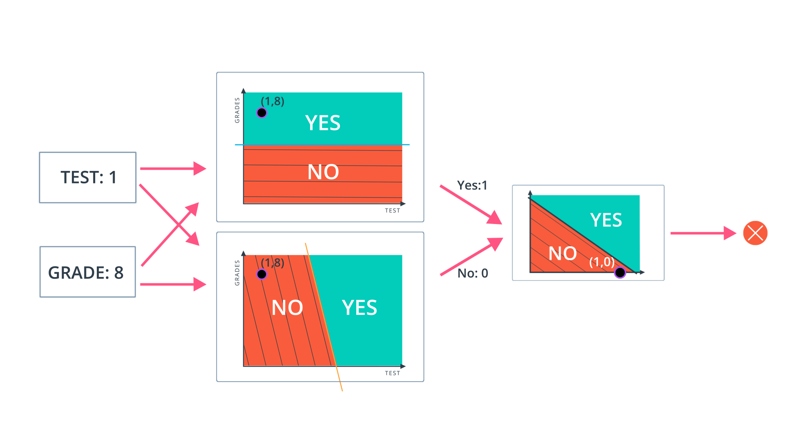

## Perceptron
Now you've seen how a simple neural network makes decisions: by taking in input data, processing that information, and finally, producing an output in the form of a decision! Let's take a deeper dive into the university admission example to learn more about processing the input data.

Data, like test scores and grades, are fed into a network of interconnected nodes. These individual nodes are called perceptrons, or artificial neurons, and they are the basic unit of a neural network. Each one looks at input data and decides how to categorize that data. In the example above, the input either passes a threshold for grades and test scores or doesn't, and so the two categories are: yes (passed the threshold) and no (didn't pass the threshold). These categories then combine to form a decision -- for example, if both nodes produce a "yes" output, then this student gains admission into the university.

Let's zoom in even further and look at how a single perceptron processes input data.

The perceptron above is one of the two perceptrons from the video that help determine whether or not a student is accepted to a university. It decides whether a student's grades are high enough to be accepted to the university. You might be wondering: "How does it know whether grades or test scores are more important in making this acceptance decision?" Well, when we initialize a neural network, we don't know what information will be most important in making a decision. It's up to the neural network to learn for itself which data is most important and adjust how it considers that data.

It does this with something called **weights**.

---
### Weights

When input comes into a perceptron, it gets multiplied by a weight value that is assigned to this particular input. For example, the perceptron above has two inputs, `tests` for test scores and `grades`, so it has two associated weights that can be adjusted individually. These weights start out as random values, and as the neural network network learns more about what kind of input data leads to a student being accepted into a university, the network adjusts the weights based on any errors in categorization that results from the previous weights. This is called **training** the neural network.

A higher weight means the neural network considers that input more important than other inputs, and lower weight means that the data is considered less important. An extreme example would be if test scores had no affect at all on university acceptance; then the weight of the test score input would be zero and it would have no affect on the output of the perceptron.
Summing the Input Data

Each input to a perceptron has an associated weight that represents its importance. These weights are determined during the learning process of a neural network, called training. In the next step, the weighted input data are summed to produce a single value, that will help determine the final output - whether a student is accepted to a university or not. Let's see a concrete example of this.

---
### Summing the Input Data

Each input to a perceptron has an associated weight that represents its importance. These weights are determined during the learning process of a neural network, called training. In the next step, the weighted input data are summed to produce a single value, that will help determine the final output - whether a student is accepted to a university or not. Let's see a concrete example of this.

We weight `x_test` by `w_test` and add it to `x_grades` weighted by `w_grades`.
