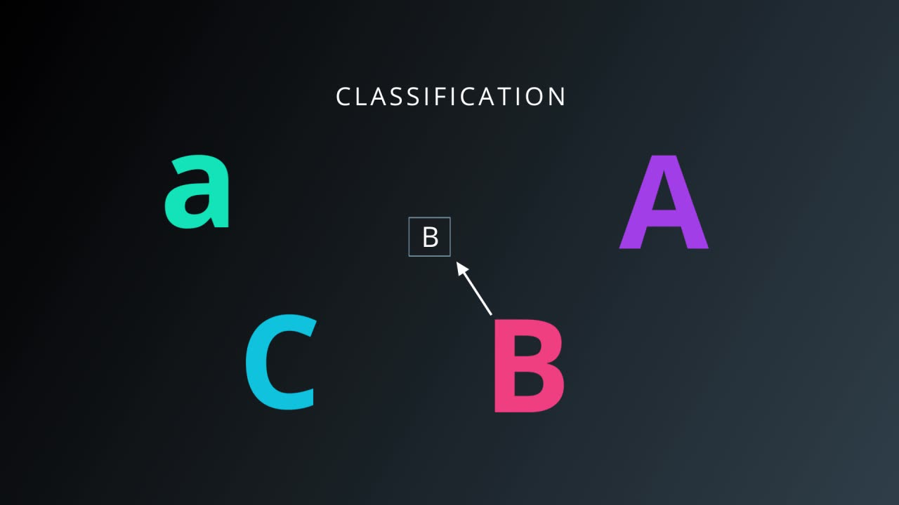

Good job! You've accomplished a lot. In
particular, you did the following:
- Ran operations in `tf.session`.
- Created a
constant tensor with `tf.constant()`.
- Used `tf.placeholder()` and `feed_dict`
to get input.
- Applied the `tf.add()`, `tf.subtract()`, tf.multiply(), and
tf.divide() functions using numeric data.

You know the basics of TensorFlow, so
let's take a break and get back to the theory of neural networks. In the next
few videos, you're going to learn about one of the most popular applications of
neural networks - classification.
