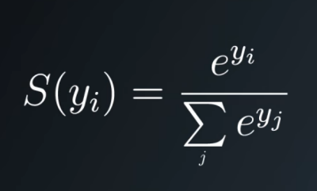

Softmax Function

## Softmax
Congratulations on successfully implementing a linear function that outputs logits. You're one step closer to a working classifier.

The next step is to assign a probability to each label, which you can then use to classify the data. Use the softmax function to turn your logits into probabilities.

We can do this by using the formula above, which uses the input of $y$ values and the mathematical constant "$e$" which is approximately equal to 2.718. By taking "$e$" to the power of any real value we **always get back a positive value**, this then helps us scale when having negative y values. The summation symbol on the bottom of the divisor indicates that we add together all the $e^y$(input $y$ value) elements in order to get our calculated probability outputs.

---
## Quiz
For the next quiz, you'll implement a `softmax(x)` function that takes in `x`, a one or two dimensional array of logits.

In the one dimensional case, the array is just a single set of logits. In the two dimensional case, each column in the array is a set of logits. The `softmax(x)` function should return a NumPy array of the same shape as `x`.

For example, given a one-dimensional array:
 ```python
# logits is a one-dimensional array with 3 elements
logits = [1.0, 2.0, 3.0]
# softmax will return a one-dimensional array with 3 elements
print softmax(logits)
 ```
 
Output:
 ```python
[ 0.09003057  0.24472847  0.66524096]
 ```

Given a two-dimensional array where each column represents a set of logits:
 ```python
# logits is a two-dimensional array
logits = np.array([
    [1, 2, 3, 6],
    [2, 4, 5, 6],
    [3, 8, 7, 6]])
# softmax will return a two-dimensional array with the same shape
print softmax(logits)
 ```

Output:
 ```python
[
 [ 0.09003057  0.00242826  0.01587624  0.33333333]
 [ 0.24472847  0.01794253  0.11731043  0.33333333]
 [ 0.66524096  0.97962921  0.86681333  0.33333333]
]
 ```
 
Implement the softmax function, which is specified by the formula at the top of the page.

The probabilities for each column must sum to 1. Feel free to test your function with the inputs above.

**Quiz**

```{.python .input}
# Solution is available in the other "solution.py" tab
import numpy as np


def softmax(x):
    """Compute softmax values for each sets of scores in x."""
    # TODO: Compute and return softmax(x)

logits = [3.0, 1.0, 0.2]
print(softmax(logits))
```

**Solution**

```{.python .input}
# Quiz Solution
# Note: You can't run code in this tab
import numpy as np


def softmax(x):
    """Compute softmax values for each sets of scores in x."""
    return np.exp(x) / np.sum(np.exp(x), axis=0)

logits = [3.0, 1.0, 0.2]
print(softmax(logits))
```
