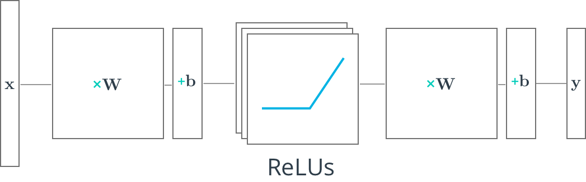

## Multilayer Neural Networks
In this lesson, you'll learn how to build multilayer neural networks with TensorFlow. Adding a hidden layer to a network allows it to model more complex functions. Also, using a non-linear activation function on the hidden layer lets it model non-linear functions.

Next, you'll see how a ReLU hidden layer is implemented in TensorFlow.

Note: Depicted above is a "2-layer" neural network:
- The first layer effectively consists of the set of weights and biases applied to X and passed through ReLUs. The output of this layer is fed to the next one, but is not observable outside the network, hence it is known as a **hidden layer**.

- The second layer consists of the weights and biases applied to these intermediate outputs, followed by the softmax function to generate probabilities.

