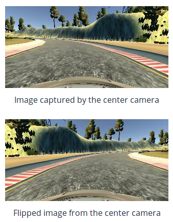

**see the video**

### Flipping Images And Steering Measurements

A effective technique for helping with the left turn bias involves flipping images and taking the opposite sign of the steering measurement. For example:

```python
import numpy as np
image_flipped = np.fliplr(image)
measurement_flipped = -measurement
```

The `cv2` library also has similar functionality with the [flip method](http://docs.opencv.org/2.4/modules/core/doc/operations_on_arrays.html#flip).

