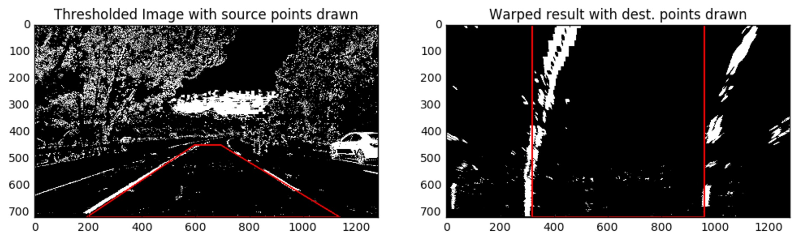

In the project at the end of this module, the first thing you'll do is to compute the camera calibration matrix and distortion coefficients. You only need to compute these once, and then you'll apply them to undistort each new frame. Next, you'll apply thresholds to create a binary image and then apply a perspective transform.

---
## Thresholding

You'll want to try out various combinations of color and gradient thresholds to generate a binary image where the lane lines are clearly visible. There's more than one way to achieve a good result, but for example, given the image above, the output you're going for should look something like this:

---
## Perspective Transform
Next, you want to identify four source points for your perspective transform. In this case, you can assume the road is a flat plane. This isn't strictly true, but it can serve as an approximation for this project. You would like to pick four points in a trapzoidal shape (similar to region masking) that would represent a rectangle when looking down on the road from above.

The easiest way to do this is to investigate an image where the lane lines are straight, and find four points that along the lines that, after perspective transform, make the lines look straight and vertical from a bird's eye view perspective.

Here's an example of the result you are going for with straight lane lines:

---
## Now for curved lines
Those same four source points will now work to transform any image (again, under the assumption that the road is flat and the camera perspective hasn't changed). When appling the transform to new images, the test of whether or not you got the transform correct, is that the lane lines should appear parallel in the warped images, wheter they are straight or curved.

Here's an example of appling a perspective transform to your thresholded binary image, using the same source and destination points as above, showing that the curved lines are (more or less) parallel in the transformed image:

