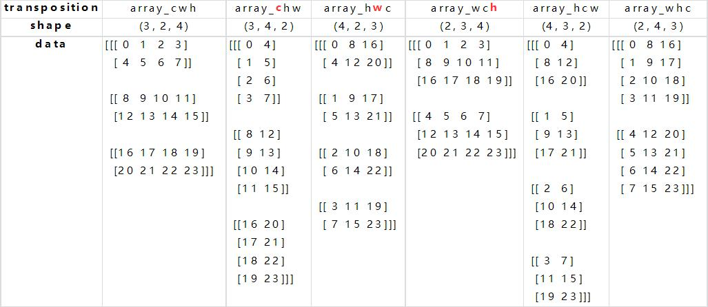

## 默认转置 `array.T`
我们构造一个三维的数组，其 shape 为 1x2x2 (例如channel x row x col)，转置后的 shape 应该为 2x2x1 (col x row x channel)。原位置如 [1,1,0] 会转置到新的位置 [0,1,1]

 ```python
import numpy as np
array_1x2x2 = np.array([[['000', '001'], ['010', '011']]])
array_T_2x2x1 = array_1x2x2.T

print(array_1x2x2)
>>>
[[['000' '001']
  ['010' '011']]]

# ---
print(array_T_2x2x1)
>>>
[[['000']
  ['010']]

 [['001']
  ['011']]]

# ---
print(array_1x2x2.shape)
print(array_T_2x2x1.shape)
>>>
(1, 2, 2)
(2, 2, 1)

# ---
print(np.argwhere(array_T_2x2x1 == array_1x2x2[0, 1, 1]))
print(array_T_2x2x1[1, 1, 0])
print(array_1x2x2[0, 1, 1])
>>>
[[1 1 0]]
011
011
 ```

类似的例子，可以用`np.argwhere`辅助寻找（注意不能有相同值）:

 ```python
import numpy as np
array_1x2x3 = np.arange(6).reshape((1,2,3))
array_T_3x2x1 = array_1x2x3.T

print(array_1x2x3)
>>>
[[[0 1 2]
  [3 4 5]]]

# --- 
print(array_T_3x2x1)
[[[0]
  [3]]

 [[1]
  [4]]

 [[2]
  [5]]]

# ---
print(array_1x2x3.shape)
print(array_T_3x2x1.shape)
(1, 2, 3)
(3, 2, 1)

## ---
print(np.argwhere(array_T_3x2x1 == array_1x2x3[0, 1, 1]))
print(array_1x2x3[0, 1, 1])
print(array_T_3x2x1[1, 1, 0])
>>>
[[1 1 0]]
4
4
 ```

---
## 三维ararry转置详解



我们构造一个3x2x4的三维矩阵，如第一列的 `array_cwh` (c=3, w=2, h=4)。

首先我们先做最简单的 wh 转置（保持 c 不动），这就是我们很熟悉的二位转置（行列互换），得到 `array_chw` 。

然后我们做个稍微复杂点的第一维（h）和第三维（c）转置（保持 w 不动），得到 `array_cwh => array_hwc` 。**分析技巧**，`c3 => c1, h1 => h3`，也就是原来第三维 c 转到第一维，原来第一维 h 转到第三维。
> 这里我们默认第一维是最低维，以此类推。

1. 例如 `c3 => c1`: `array_cwh` 第一维空间中的  `array_cwh[0, 0, :]` 即 `[0 1 2 3]` 被转置到 `array_hwc` 的第三维空间中 `array_hwc[:, 0, 0]`。

2. 同样 `h1 => h3`: `array_cwh` 第三维空间中的 `array_cwh[:, 0, 0]` 即 `[[[0]], [[8]], [[16]]]` 被转置到了 `array_hwc` 的第一维空间中 `array_hwc[0, 0, :]` 即 `[[[0, 8, 16]]]`。


最后我们来看最复杂的三个维度都变换的情况。`array_cwh => array_hcw`，**分析技巧**，`c3 => c2, w2 => w1, h1 => h3`。
1. `c3 => c2`, 第三维空间中的 `array_cwh[:, 0, 0]` 即 `[[[0]], [[8]], [[16]]]` 被转置到了 `array_hcw` 的第二维空间中 `array_hwc[0, :, 0]` 即 `[[[0], [8], [16]]]`
2. `w2 => w1`, 第二维空间中的 `array_cwh[0, :, 0]` 即 `[[[0], [4]]` 被转置到了 `array_hcw` 的第一维空间中 `array_hwc[0, 0, :]` 即 `[[[0, 4]]]`
1. `h1 => h3`, 第一维空间中的 `array_cwh[0, 0, :]` 即 `[[[0, 1, 2, 3]]]` 被转置到了 `array_hcw` 的第三维空间中 `array_hwc[:, 0, 0]` 即 `[[[0], [1], [2]]]`

```{.python .input  n=1}
import numpy as np
np.set_printoptions(formatter={'int_kind': '{:2d}'.format})

c = 3
w = 2
h = 4

array_cwh = np.arange(c*w*h).reshape((c, w, h))
print(array_cwh)
```

```{.python .input  n=2}
array_chw = np.transpose(array_cwh, axes=[0, 2, 1]) # reshape(c, h, w)
print('array_chw:')
print('shape:', array_chw.shape)
print(array_chw)
```

```{.python .input  n=3}
array_hwc = np.transpose(array_cwh, axes=[2, 1, 0]) # reshape(h, w, c)
print('array_hwc:')
print('shape:', array_hwc.shape)
print(array_hwc)
```

```{.python .input  n=4}
array_wch = np.transpose(array_cwh, axes=[1, 0, 2]) # reshape(w, c, h)
print('array_wch:')
print('shape:', array_wch.shape)
print(array_wch)
```

```{.python .input  n=5}
array_whc = np.transpose(array_cwh, axes=[1, 2, 0]) # reshape(w, h, c)
print('array_whc:')
print('shape:', array_whc.shape)
print(array_whc)
```

```{.python .input  n=6}
array_hcw = np.transpose(array_cwh, axes=[2, 0, 1]) # reshape(h, c, w)
print('array_hcw:')
print('shape:', array_hcw.shape)
print(array_hcw)
```
