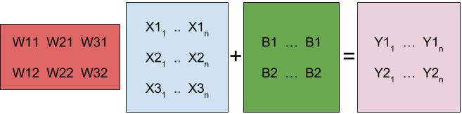

You can’t train a neural network on a single sample. Let’s apply n samples of
$x$ to the function $y = Wx + b$, which becomes $Y = WX + B$.

$Y = WX + B$

For every sample of $X (X1, X2, X3)$,
we get logits for label 1 ($Y1$) and label 2 ($Y2$).

In order to add the bias
to the product of $WX$, we had to turn $b$ into a matrix of the same shape. This
is a bit unnecessary, since the bias is only two numbers. It should really be a
vector.

We can take advantage of an operation called broadcasting used in
TensorFlow and Numpy. This operation allows arrays of different dimension to be
added or multiplied with each other. For example:

```{.python .input  n=1}
import numpy as np
t = np.array([[1, 2, 3], [4, 5, 6], [7, 8, 9], [10, 11, 12]])
u = np.array([1, 2, 3])
print(t + u)
```

The code above will print...
 ```python
    [[ 2  4  6]
     [ 5  7  9]
     [ 8 10 12]
     [11 13 15]]
 ```

This is because $u$ is the same dimension as the **last
dimension**
in $t$.
