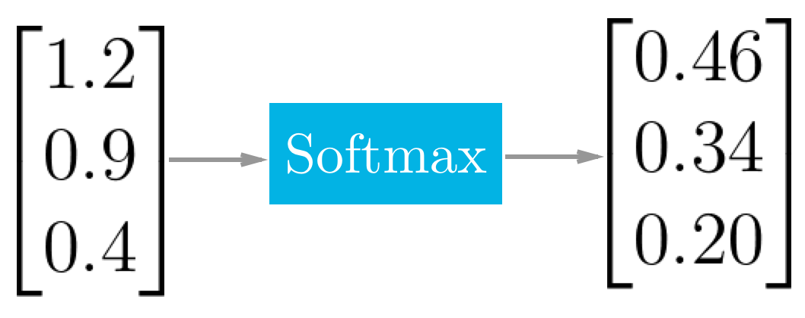

## TensorFlow Softmax
Now that you've built a softmax function from scratch, let's see how softmax is done in TensorFlow.

`x = tf.nn.softmax([2.0, 1.0, 0.2])`

Easy as that! `tf.nn.softmax()` implements the softmax function for you. It takes in logits and returns softmax activations.

**Quiz:**  
Use the softmax function in the quiz below to return the softmax of the logits.


```{.python .input}
# Solution is available in the other "solution.ipynb" 
import tensorflow as tf


def run():
    output = None
    logit_data = [2.0, 1.0, 0.1]
    logits = tf.placeholder(tf.float32)
    
    # TODO: Calculate the softmax of the logits
    # softmax =     
    
    with tf.Session() as sess:
        pass
        # TODO: Feed in the logit data
        # output = sess.run(softmax,    )

    return output
```

**Ans:**  
 ```python
# Quiz Solution
import tensorflow as tf

def run():
    output = None
    logit_data = [2.0, 1.0, 0.1]
    logits = tf.placeholder(tf.float32)
    softmax = tf.nn.softmax(logits)
    #
    with tf.Session() as sess:
        output = sess.run(softmax, feed_dict={logits: logit_data})
    #
    return output
 ```

**Quiz**  
Answer the following 2 questions about softmax.

**习题 1/2**  
Q: What happens to the softmax probabilities when you multiply the logits by 10?
1. Probabilities get close to 0.0 or 1.0
2. Probabilities get close to the uniform distribution

Ans: 1


**习题 2/2**  
Q: What happens to the softmax probabilities when you divide the logits by 10?
1. Probabilities get close to 0.0 or 1.0
2. Probabilities get close to the uniform distribution

Ans: 2
> Since all the scores decrease in magnitude, the resulting softmax probabilities will be closer to each other.
