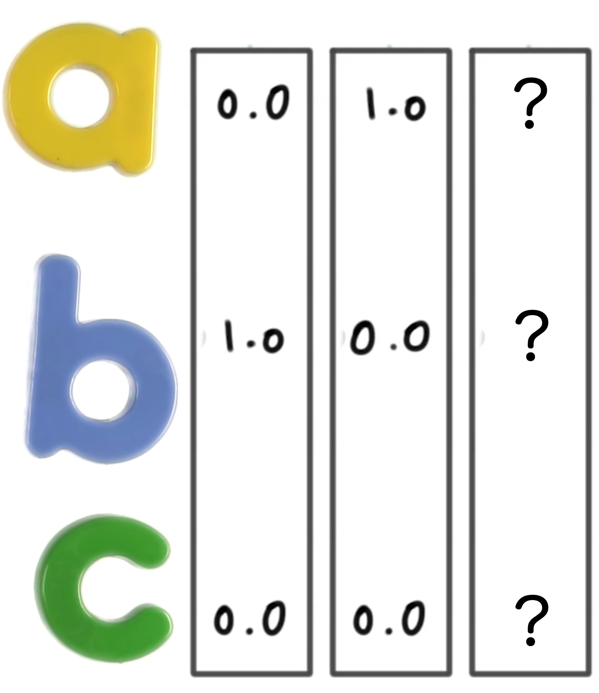

**Quiz**  
With the labels ["A", "B", "C"] and one-hot encodings from above, select the missing one-hot encoding:
1. [1.0, 0.0, 1.0]
2. [0.0, 0.0, 0.0]
3. [0.0, 1.0, 0.0]
4. [0.0, 0.0, 1.0]

**Ans**  
4
