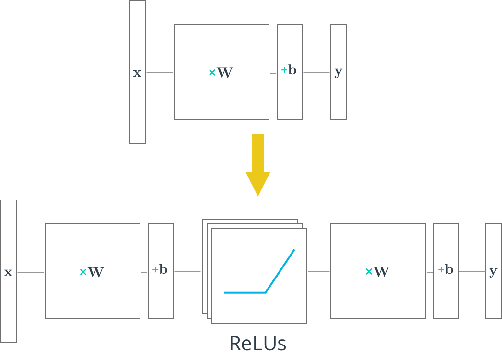

A Rectified linear unit (ReLU) is type of [activation function](https://en.wikipedia.org/wiki/Activation_function) that is defined as `f(x) = max(0, x)`. The function returns 0 if `x` is negative, otherwise it returns `x`. TensorFlow provides the ReLU function as `tf.nn.relu()`, as shown below.

 ```python
# Hidden Layer with ReLU activation function
hidden_layer = tf.add(tf.matmul(features, hidden_weights), hidden_biases)
hidden_layer = tf.nn.relu(hidden_layer)
#
output = tf.add(tf.matmul(hidden_layer, output_weights), output_biases)
 ```
 
The above code applies the `tf.nn.relu()` function to the `hidden_layer`, effectively turning off any negative weights and acting like an on/off switch. Adding additional layers, like the `output` layer, after an activation function turns the model into a nonlinear function. This nonlinearity allows the network to solve more complex problems.

## Quiz


In this quiz, you'll use TensorFlow's ReLU function to turn the linear model below into a nonlinear model. 

[Quiz_jupyter.md](./L8_Quiz/Quiz_jupyter.md)

[solution_jupyter.md](./L8_Quiz/solution_jupyter.md)
