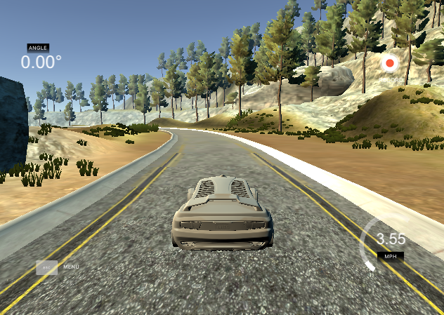

### Center Driving

So that the car drives down the center of the road, it's essential to capture center lane driving. Try driving around the track various times while staying as close to the middle of the track as possible even when making turns. 

In the real world, the car would need to stay in a lane rather than driving down the center. But for the purposes of this project, aim for center of the road driving.

**Example of Center Lane Driving**

## Strategies for Collecting Data

Now that you have driven the simulator and know how to record data, it's time to think about collecting data that will ensure a successful model. There are a few general concepts to think about that we will later discuss in more detail:

- the car should stay in the center of the road as much as possible
- if the car veers off to the side, it should recover back to center
- driving counter-clockwise can help the model generalize
- flipping the images is a quick way to augment the data
- collecting data from the second track can also help generalize the model 
- we want to avoid overfitting or underfitting when training the model
- knowing when to stop collecting more data

