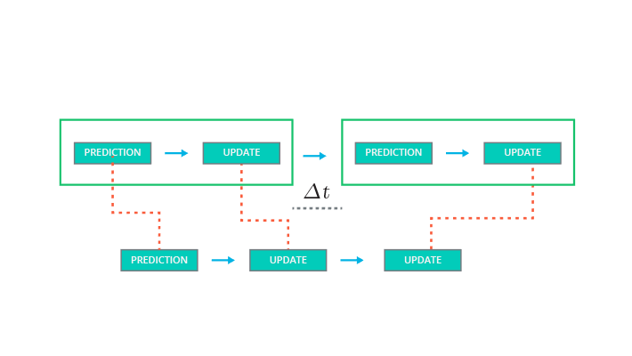

## Additional Info about the Last Quiz

Because we have already run a prediction-update iteration with the first sensor at time k+3, the output of the second prediction at time k+3 will actually be identical to the output from the update step with the first sensor. So, in theory, you could skip the second prediction step and just run a prediction, update, update iteration.

But you'll learn more about that later. First, a bit of math.

**see the video**

## Kalman Filter Intuition

The Kalman equation contains many variables, so here is a high level overview to get some intuition about what the Kalman filter is doing. 

### Prediction

Let's say we know an object's current position and velocity , which we keep in the $x$ variable. Now one second has passed. We can predict where the object will be one second later because we knew the object position and velocity one second ago; we'll just assume the object kept going at the same velocity. 

The $x′=Fx+ν​$ equation does these prediction calculations for us.

But maybe the object didn't maintain the exact same velocity. Maybe the object changed direction, accelerated or decelerated. So when we predict the position one second later, our uncertainty increases. $P′=FPF^T+Q$ represents this increase in uncertainty.

Process noise refers to the uncertainty in the prediction step. We assume the object travels at a constant velocity, but in reality, the object might accelerate or decelerate. The notation $\nu \sim N(0, Q)$ defines the process noise as a gaussian distribution with mean zero and covariance $Q$. 

### Update

Now we get some sensor information that tells where the object is relative to the car. First we compare where we think we are with what the sensor data tells us $y=z−Hx′​$. 

The $K$ matrix, often called the Kalman filter gain, combines the uncertainty of where we think we are $P′$ with the uncertainty of our sensor measurement $R$. If our sensor measurements are very uncertain ($R$ is high relative to $P'$), then the Kalman filter will give more weight to where we think we are: $x′$. If where we think we are is uncertain ($P'$ is high relative to $R$), the Kalman filter will put more weight on the sensor measurement: $z​$. 

Measurement noise refers to uncertainty in sensor measurements. The notation $\omega \sim N(0, R)$ defines the measurement noise as a gaussian distribution with mean zero and covariance $R$. Measurement noise comes from uncertainty in sensor measurements.

## A Note About the State Transition Function: Bu

If you go back to the video, you'll notice that the state transition function was first given as $x′=Fx+Bu+ν$.

But then $Bu$ was crossed out leaving $x′=Fx+ν$. 

$B$ is a matrix called the control input matrix and $u$ is the control vector. 

As an example, let's say we were tracking a car and we knew for certain how much the car's motor was going to accelerate or decelerate over time; in other words, we had an equation to model the exact amount of acceleration at any given moment. $Bu$ would represent the updated position of the car due to the internal force of the motor. We would use $\nu$ to represent any random noise that we could not precisely predict like if the car slipped on the road or a strong wind moved the car.

For the Kalman filter lessons, we will assume that there is no way to measure or know the exact acceleration of a tracked object. For example, if we were in an autonomous vehicle tracking a bicycle, pedestrian or another car, we would not be able to model the internal forces of the other object; hence, we do not know for certain what the other object's acceleration is. Instead, we will set $Bu=0$ and represent acceleration as a random noise with mean $\nu$.