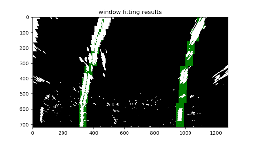

Another way to approach the sliding window method is to apply a convolution, which will maximize the number of "hot" pixels in each window. A convolution is the summation of the product of two separate signals, in our case the window template and the vertical slice of the pixel image.

You slide your window template across the image from left to right and any overlapping values are summed together, creating the convolved signal. The peak of the convolved signal is where there was the highest overlap of pixels and the most likely position for the lane marker.

Now let's try using convolutions to find the best window center positions in a thresholded road image. The code below allows you to experiment with using convolutions for a sliding window search function. Go ahead and give it a try.



```{.python .input  n=3}
import numpy as np
import matplotlib.pyplot as plt
import matplotlib.image as mpimg
import glob
import cv2
%matplotlib inline

# Read in a thresholded image
warped = mpimg.imread('../data/L9_6_warped_example.jpg')
# window settings
window_width = 50
window_height = 80  # Break image into 9 vertical layers since image height is 720
margin = 100  # How much to slide left and right for searching


def window_mask(width, height, img_ref, center, level):
    output = np.zeros_like(img_ref)
    output[int(img_ref.shape[0] - (level + 1) * height):int(img_ref.shape[0] -level * height),
           max(0, int(center - width / 2)):min(int(center + width / 2), img_ref.shape[1])] = 1
    return output


def find_window_centroids(image, window_width, window_height, margin):

    # Store the (left,right) window centroid positions per level
    window_centroids = []
    # Create our window template that we will use for convolutions
    window = np.ones(window_width)

    # First find the two starting positions for the left and right lane by using np.sum to \
    # get the vertical image slice and then np.convolve the vertical image slice with the window template
    # Sum quarter bottom of image to get slice, could use a different ratio
    l_sum = np.sum(image[int(3 * image.shape[0] / 4):, 
                         :int(image.shape[1] / 2)], 
                   axis=0)
    l_center = np.argmax(np.convolve(window, l_sum)) - window_width / 2
    r_sum = np.sum(image[int(3 * image.shape[0] / 4):, int(image.shape[1] / 2):],
                   axis=0)
    r_center = np.argmax(np.convolve(window, r_sum)) - window_width/2+int(image.shape[1]/2)

    # Add what we found for the first layer
    window_centroids.append((l_center, r_center))

    # Go through each layer looking for max pixel locations
    for level in range(1, (int)(image.shape[0] / window_height)):
        # convolve the window into the vertical slice of the image
        image_layer = np.sum(image[int(image.shape[0] - (level + 1) * window_height):
                                   int(image.shape[0] - level * window_height), :],
                             axis=0)
        conv_signal = np.convolve(window, image_layer)
        # Find the best left centroid by using past left center as a reference
        # Use window_width/2 as offset because convolution signal reference is at right side of window,
        # not center of window
        offset = window_width / 2
        l_min_index = int(max(l_center + offset - margin, 0))
        l_max_index = int(min(l_center + offset + margin, image.shape[1]))
        l_center = np.argmax(conv_signal[l_min_index:l_max_index]) + l_min_index - offset
        # Find the best right centroid by using past right center as a reference
        r_min_index = int(max(r_center + offset - margin, 0))
        r_max_index = int(min(r_center + offset + margin, image.shape[1]))
        r_center = np.argmax(conv_signal[r_min_index:r_max_index]) + r_min_index - offset
        # Add what we found for that layer
        window_centroids.append((l_center, r_center))

    return window_centroids


window_centroids = find_window_centroids(warped, window_width, window_height,
                                         margin)

# If we found any window centers
if len(window_centroids) > 0:

    # Points used to draw all the left and right windows
    l_points = np.zeros_like(warped)
    r_points = np.zeros_like(warped)

    # Go through each level and draw the windows
    for level in range(0, len(window_centroids)):
        # Window_mask is a function to draw window areas
        l_mask = window_mask(window_width, window_height, warped, window_centroids[level][0], level)
        r_mask = window_mask(window_width, window_height, warped, window_centroids[level][1], level)
        # Add graphic points from window mask here to total pixels found
        l_points[(l_points == 255) | ((l_mask == 1))] = 255
        r_points[(r_points == 255) | ((r_mask == 1))] = 255

    # Draw the results
    # add both left and right window pixels together
    template = np.array(r_points + l_points, np.uint8)
    zero_channel = np.zeros_like(template)  # create a zero color channel
    # make window pixels green
    template = np.array(cv2.merge((zero_channel, template, zero_channel)), np.uint8)
    # making the original road pixels 3 color channels
    warpage = np.dstack((warped, warped, warped)) * 255
    # overlay the orignal road image with window results
    output = cv2.addWeighted(warpage, 1, template, 0.5, 0.0)

# If no window centers found, just display orginal road image
else:
    output = np.array(cv2.merge((warped, warped, warped)), np.uint8)

# Display the final results
plt.imshow(output)
plt.title('window fitting results')
plt.show()
```
